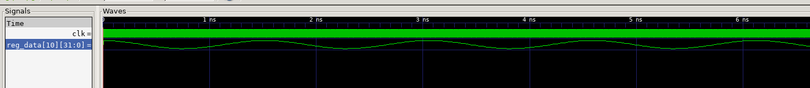

### Overview
This branch was used for our original single cycle implementation of the RISC-V CPU. 

Using our completed Lab 4, we created this branch to be an extension of the CPU and have all components added. This included adding data memory and adding in the controls for all the different instruction types.

We also used this branch for the F1 lights testing.

However, due to a decision to reformat the CPU, it was moved to a new branch called SINGLE-CYCLE-REDO. This was built based on the logic used in this branch but adapted so as to be simplified into fewer sheets. 

Thus, this branch has been tested for most simple instructions but is not fully implemented.

 ### Testing results
 #### Instructions testing - ADDI, SUB, OR, LBU, SB etc

It can be seen that the simple individual instructions are working.

#### Sine test

This generates it as expected.

#### F1 lights
We then tested ou1 F1 assembly code to see if the J-type instructions worked. The Vbuddy succesfully used our assembly code show display the F1 lights

https://github.com/sirampy/Team22/assets/48381979/83a4b378-8004-4d97-8427-617aa3a2eff7

