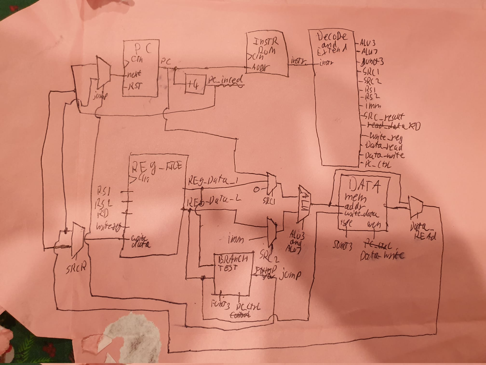

# Team 22 - RISC-V RV32I Processor

## About this branch
This branch was created as a result of a decoder redesign intended to create a more robust microarchitecture desigened from the ground up to efficiently support the entire rv32i instruction set. Thhe V2 cpu also aims to solve code clarity issues with extensive usee of enums and unions for control signals to minimise "magic numbers" in the codebase. 

## Structure
V2 has been structured to seperate the RTL design and testing as much as possible:
### revised_microarch
This is where the RTL design lives. I recommend starting with top.sv and decoder.sv to get an idea of how the instructions are excecuted

### rom_bin
this directory contains .mem files which are loaded as ascii hex into the RTL modle when running a testbench. This also contains a dissasembled version of the elf for debugging purposes, and is used as the build folder by the assembler

### test
this contains a testbench that stimulates the top level module's clock, as well as source files for test programs. The idea is that diferent parts of the instruction set can be tested with diferent test programs and verified manually with gtkwave. this keeps testing simple and removes the need for highly specific testbenches.

### Makefile
this file contains scripts for building and testing the project.

### Other
The rest of the files / folders relate to documentation and explanation of tests, or are legacy code from v1.

## Architecture

The above photo shows a rough diagram of the microarhitecture. The design re-uses the ALU for anny instruction needing an adder, making the architecture highly efficient and closely taylored to the instruction set. The control signals generated by the decoder makes it easy for extensions to be added dont the line that may re-use components form the RV32I. to maximise efficiency, several control signals are taken directly from the opcode for certain instructions. 

This approach also lends itself nicely for decoder to be fited with [microcode](https://en.wikipedia.org/wiki/Microcode) rom (not to be mistaken with firmware), allowing for bug fixes post production, and even user customisable opcodes and instructions.

## How to use
All of the scripts need to test / build this branch are in the makefile.
First initialise the program mems by building a test program:
```
make <program_name>
```
Then run the simulation 
```
make run
```
Finally, you can open gtkwave
```
make gtk
```
explore the makefile yourself for futher use cases.
for more info see [testing results](testing_results.md)

## Group Details
---
| Name           | CID      | GitHub   | Email                     | Personal Statement|
|----------------|----------|----------|---------------------------|--------------|
| Alex Charlton |  | **sirampy**  |       | [Alex's Statement](https://github.com/sirampy/Team22/blob/main/statements/Alex%20Charlton.md) |
| Beth Cham    | 02193797 | **bethcham** | beth.cham22@imperial.ac.uk | [Beth's Statement](https://github.com/sirampy/Team22/blob/main/statements/Beth%20Cham.md) |
| Dell Saxena | 02258324 | **Dell-S** | dell.saxena22@imperial.ac.uk |  [Dell's Statement](https://github.com/sirampy/Team22/blob/main/statements/Dell%20Saxena.md) |
| Mateusz Pietrzkiewicz |  | **MateuszP137**  |  | [Mateusv's Statement](https://github.com/sirampy/Team22/blob/main/statements/Mateusz%20Pietrzkiewicz.md) |
| Sophie Jayson |  | **Slayque3n**  |  | [Sophie's Statement](https://github.com/sirampy/Team22/blob/main/statements/Sophie%20Jayson.md) |

## Division of Tasks
---
Main Sections
1. Testing (Testbenches for all individual components, only the main top-level module, coming up with machine code, testing for all instructions)
2. ALU (mostly done) + Data mem (actually still needs to be done my bad - create data mem module, add read_data mux, link it to alu+register file) + Implementing and testing F1 Vbuddy lights, test Lab4 code given by peter
3. Control unit (Implement all types of instructions - Load, Store, Jump, Branch etc) + PC
4. Pipelining
5. Cache

Note: Testbenches written by Person 1, but all other members utilize and change testbenches as needed when testing their own portion

### CPU tasks allocations (main responsibilities):
**Alex:** Cache 

**Beth:** Pipelining

**Dell:** Testbench and verification of design

**Mateusv:** ALU, Data Mem, Implement F1 Lights algorithm

**Sophie:** Control Unit, PC

### Component split (currently incomplete list of modules):
---
| File Name     | Alex  | Beth | Dell | Mateusv |  Sophie  |
|:-----------|:-----------:|:----------:|:-----------:|:-----------:|:-----------:|
| alu_top.sv | | | | | 
| alu.sv | | | | | 
| reg_file.sv | | | | | 
| control_top.sv | | | | | 
| main_decoder.sv | | | | |
| alu_decoder.sv | | | | | 
| instr_mem.sv | | | | | 
| program_mem.sv | | | | | 
| sign_extend.sv | | | | | 
| pc_top.sv | | | | |
| pc_reg.sv | | | | |
| top.sv (singlecycle) | | | | | 
| top.sv (pipeline) | | | | | 
| cpu_tb.cpp | | | | | 
| F1Assembly.s | | | | | 

LEGEND :       `x` = full/main responsibility;  `p` = partial contribution; 

&nbsp;   
# Joint Statement 


## Repository Structure

## Summary of Approach

## Testing Instructions

as a team, we encounted some troubles when it came to creating the top file and putting the whole CPU together; as we had not previously discussed naming conventions. However, with a short discussion and a few simple changes these problems were easily overcome.


> instruction set reference: https://www.cs.sfu.ca/~ashriram/Courses/CS295/assets/notebooks/RISCV/RISCV_CARD.pdf <br>
> system verilog style guide: https://www.systemverilog.io/verification/styleguide/#variables