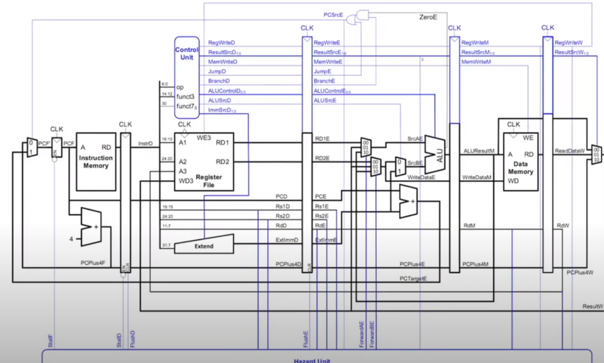

# PIPELINING 2.0
When beginning testing and debugging of the original pipeline-hazards branch, we noticed lots of errors, mostly within the top level file and the use of an old, uncompleted control unit, but also from  within the logic of the hazard unit. And so, in order to get pipelining working for the original SINGLE-CYCLE branch, we, as a team, decided it would be best to start again; which created this branch.

This branch aims to create and run the architecture seen below:

## Hazard unit logic
### Forwarding 

One hazard that could evolve is data depndancies to combat this the results and other data would have to be fast forwarded. If the the registers in the execute stage match the Rd in the memmory stage, then the mem stage needs to be fast forwarded. Otherwise if the the registers in the execute stage match the Rd in the store stage, then the store stage needs to be fast forwarded. Finally, if 
anything else is happening the cycle just continues on normally.

In order to do this we added in multiplexers to the sources of the alu inputs, with the options of picking between the regular input from the pipeline register or the fast wards values.

### Stalling 
An error will occur typically when a lw instruction takes place, as the correct value will not be fully passed through the system for 5 clock cycles. Therefore the system has to be paused (stalled) to allow the instruction to pass through the pipelining registers, and the execute registers will be flushed in order to create a bubble for it.
 
### Flushing
if the system has predicted the wrong next instruction (aka a jump or branch instruction has occured) then the system needs to be flushed to remove the wrong data loaded into the pipeline

## Pipeline registers

### Fetch to Decode

This register sits between the instruction memory and the control and register units and delays the instruction passed to the respective units as well as the pcplus4 result. this register Contains both a stall and a flush option

### Decode to Execute
This register sits between  the reg file and the alu, as well as taking in the necessary control signles. This register also contains a flush option and the rs inputs and outputs flowing into the hazard unit to check the intructions.

### Execute to Memory
 This register sits between the alu output and the data memory, it stores the control signals for the reg and memory writing as well as the pc plus 4. The outputs of this register will be have to be attached to the fast-forward multiplexers to allow for data depneddancies.

### Memory to Store

This reguster stores the data  and control signalas necessary for wwriting back to the register file. This register does not need any kind of hazard Unit input as it is only storing information that has already been executed, and therefore is not going to have any kind of ionterfence with previous instructions.