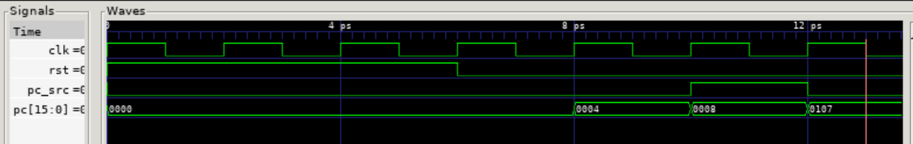

## Individual Components
### 1. Program Counter

### 2. alu+regfile
testing the datapath thoroughly is a majr taksk that envolves effectively simulating the rest of the CPU. for this reason our test program simply exists to verify that the module compiles to help debugging.
