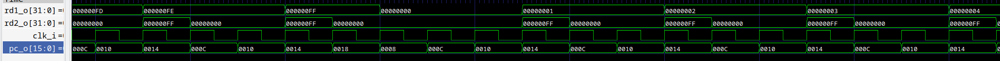

# this is a copty from V2 branch - please re-write for SINGLE-CYCLE
## methods
### scope
testing the entire instruction set that I have implemented exhaustively is a large and tedious task. Without using a pre-existing verification library (eg: https://github.com/SymbioticEDA/riscv-formal) the easiest way to easiest way to test that all parts of the processor work as intended is to test them together as one with some test programs. this may miss some edge cases, and not cover all instructions, it allows us to simply look at the output of the program to verify that it has run correctly without necesarily having to look at the program excecution on a single cycle basis
### prerequisites
to run the tests properly, you must have all the required tools installed. these include verilator, the gnu riscv toolchain and gcc targeting the machine you are building the project with. 
### running the tests
to run the tests, you first need to assemble the program to generate the correct .mem files:
```bash
make counter
```
then you need to build the cpu and run the modle:
```bash
make
make run
```
the diference between the above 2 make targets is that all will run gtkwave (this is likely the most commonly used test methood) to allow you to verify the results, whereas run will simply build the cpu (useful for getting the cpu to compile correctly). 
## test programs
### 1. Counter


we can see that the program is running and branching as intended. this test implies the successful implementation of some basic instructions, and demostrates that the architecture as a whole works
### 2. Sine

this test demonstrates that memory read instructions work
### 3. PDF
getting this to work nicely was a bit more envolved, as I had to throw together a quick python script to allow the user to select which array_data to use. The data is so large that I also need to increase the size of the data_mem to accomodate. 