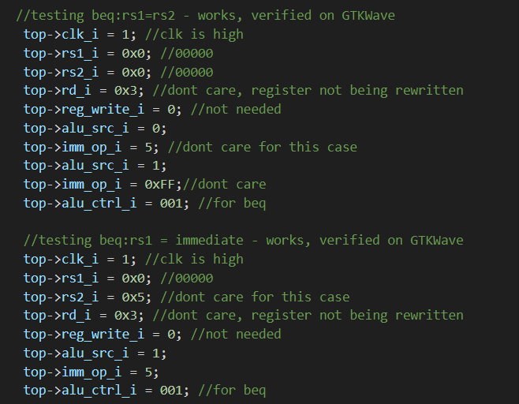
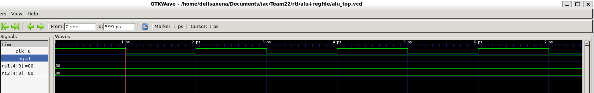

## Individual Components
### 1. Program Counter

### 2. alu+regfile

Tested alu_top.sv with alu_top_tb.cpp by directly putting input signals and checking if the output signals were as expected - verified this on GTKWave.