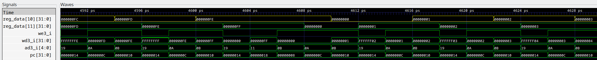
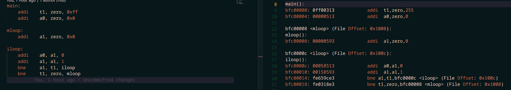

## methods
### scope
These tests are based off of the tests originally developed for the version-2 branch, which work by loading a test program into .mem files and then runing the CPU. They aim to be quick to verify, by checking the output of the program being run, and debugable using GTKWave. 
### prerequisites
to run the tests properly, you must have all the required tools installed. these include verilator, the gnu riscv toolchain and gcc targeting the machine you are building the project with. 
### running the tests
to run the tests, you first need to assemble the program to generate the correct .mem files:
```bash
make counter
```
then you need to build the cpu and run the modle:
```bash
make
make run
```
the diference between the above 2 make targets is that all will run gtkwave (this is likely the most commonly used test methood) to allow you to verify the results, whereas run will simply build the cpu (useful for getting the cpu to compile correctly). 
## test programs
### 1. Counter


The counter programs works fully as intended on this branch. The above images are from tests on the version-2 branch, but the results from this branch look identical.
### 2. Sine


### 3. PDF
