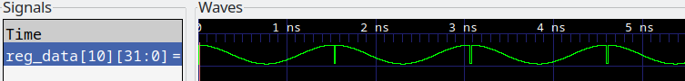

# this is a copty from V2 branch - please re-write for SINGLE-CYCLE
## methods
### scope

### prerequisites
to run the tests properly, you must have all the required tools installed. these include verilator, the gnu riscv toolchain and gcc targeting the machine you are building the project with. 
### running the tests
to run the tests, you first need to assemble the program to generate the correct .mem files:
```bash
make counter
```
then you need to build the cpu and run the modle:
```bash
make
make run
```
the diference between the above 2 make targets is that all will run gtkwave (this is likely the most commonly used test methood) to allow you to verify the results, whereas run will simply build the cpu (useful for getting the cpu to compile correctly). 
## test programs
### 1. Counter


here we can see that some basic instructions work as intended
### 2. Sine
 <br>
this test demonstrates that we can load a word form memory. this branch only has lb implemented, s it gets sign extended causing artifactig at the peak of the sine wave.
### 3. PDF
lui isnt implemented in this branch yet, so PDF wont work properly